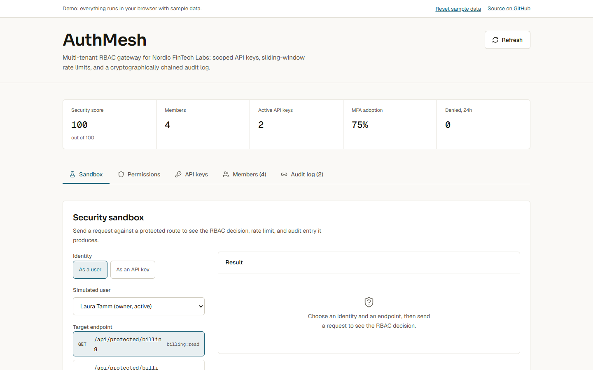
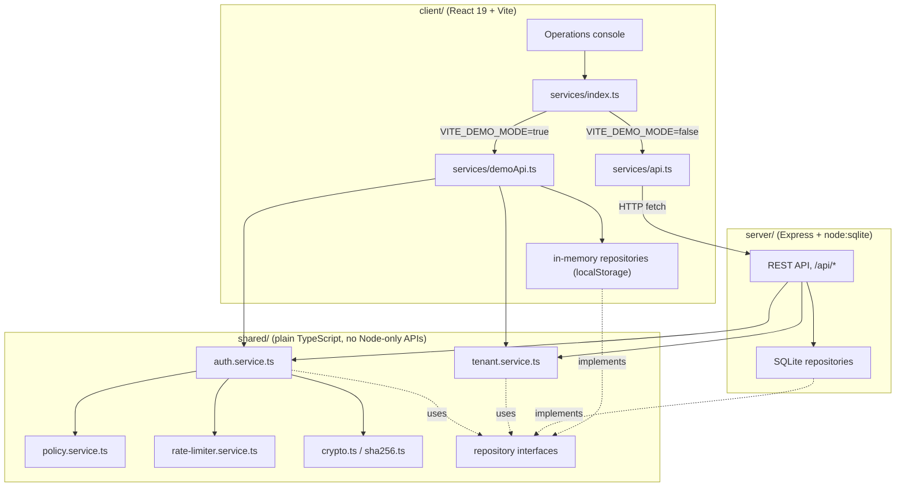

# AuthMesh

AuthMesh is a multi-tenant RBAC gateway: it evaluates permissions for users and scoped API keys, enforces per-key rate limits, and records every access decision in a SHA-256 hash-chained audit ledger. It ships with a React console for managing users and roles, generating and revoking API keys, watching the audit trail, and testing protected endpoints interactively.

[](https://github.com/Taan1el/authmesh/actions/workflows/ci.yml)
[](https://github.com/Taan1el/authmesh/actions/workflows/pages.yml)
[](LICENSE)

**Live demo:** https://taan1el.github.io/authmesh/

The demo runs entirely in your browser: the same RBAC engine, rate limiter and audit-chain code the server uses runs against an in-memory, localStorage-backed store instead of a real API, so it works with no backend.

## Who this is for

Teams that need to hand a service, script, or contractor a scoped, revocable credential instead of a shared admin password; enforce who can do what by role; and be able to show, after the fact, that the access log has not been altered. AuthMesh is the gateway and its policy engine, not a full identity provider: it does not do SSO, password login, or OAuth.

## Screenshot



More screenshots: [RBAC policy matrix](docs/screenshots/02-rbac-matrix.png), [chained audit log](docs/screenshots/03-audit-log.png), [phone width](docs/screenshots/04-mobile.png).

## Features

- **Hierarchical RBAC**: exact permissions (`users:read`), namespace wildcards (`billing:*`), and the universal wildcard (`*`), evaluated against a user's role or an API key's scopes.
- **Scoped API key vault**: keys (`am_live_<64-char hex>`) are shown in full exactly once at creation and stored only as a SHA-256 hash; revoking or letting one expire blocks it on the next request.
- **Sliding-window rate limiting** per API key, with `X-RateLimit-Limit` / `X-RateLimit-Remaining` / `X-RateLimit-Reset` headers and HTTP 429 once a key's quota is spent.
- **Hash-chained audit ledger**: every grant, denial and administrative change is linked to the previous entry by a SHA-256 hash; a verification endpoint walks the whole chain and reports the first broken block, if any.
- **Interactive security sandbox**: dispatch a request at a protected endpoint as any seeded user or API key (including an invalid one) and see the resulting HTTP status, rate-limit headers, and response body.
- **Tenant administration**: invite users, change roles, suspend and reactivate accounts, and view a live security-posture score built from MFA adoption, audit chain integrity and recent denials.
- **GitHub Pages demo mode**: no backend required; the exact same policy code runs client-side against seeded, localStorage-backed data, with a "Reset sample data" control.

## Getting started

### Prerequisites
- Node.js 22.5 or newer (built and tested on Node.js 24; `node:sqlite` needs 22.5+)
- npm 10 or newer

### Install
```bash
git clone https://github.com/Taan1el/authmesh.git
cd authmesh
npm install
```

### Run
```bash
npm run dev
```
This starts the Express API on port 4000 and the Vite dev server on port 5173. Open **http://localhost:5173**.

### Environment variables
None of these are required to run the defaults shown above.

| Variable | Used by | Default | Purpose |
|---|---|---|---|
| `PORT` | server | `4000` | Port the Express gateway listens on. See `server/.env.example`. |
| `VITE_PORT` | client (dev only) | `5173` | Port the Vite dev server listens on. See `client/.env.example`. |
| `VITE_API_TARGET` | client (dev only) | `http://localhost:4000` | Where the Vite dev server proxies `/api` requests, for when the server runs on a different port. |
| `VITE_DEMO_MODE` | client (build only) | unset | Set to `true` to build the in-browser demo instead of the real API client. Set automatically by `npm run build:pages` via `client/.env.pages`; you should not need to set it by hand. |

## Scripts

Run from the repo root unless noted otherwise.

| Script | What it does |
|---|---|
| `npm run dev` | Runs the server (`tsx watch`) and client (Vite) together |
| `npm run build` | Builds the server, then the client, for production |
| `npm run build:pages` | Builds the client in demo mode (`client/dist`), for GitHub Pages |
| `npm test` | Runs the server test suite, then the client test suite |
| `npm run lint` | Type-checks the server, then the client (`tsc --noEmit`) |

## How it works

`shared/` holds the RBAC and tenant logic used by both the server and the browser demo: `policy.service.ts` (wildcard permission matching), `rate-limiter.service.ts` (the sliding window), `crypto.ts` (API key hashing and the audit hash chain, parameterised over a SHA-256 function: the server passes `node:crypto`, the browser demo passes the small dependency-free implementation in `sha256.ts`; a parity test checks both give identical hashes), and `auth.service.ts` / `tenant.service.ts` (the actual RBAC decisions and tenant administration). Those two services depend only on the repository interfaces in `shared/repositories.ts`, not on a concrete database, so the server's SQLite-backed repositories and the browser demo's in-memory ones are interchangeable.



### Project layout

```
authmesh/
  client/                  React 19 + Vite operations console
    src/components/        Header, StatsBar, PermissionMatrix, ApiKeyVault, UserDirectory, AuditLedgerFeed, SecuritySandbox, DemoBanner
    src/services/           api.ts (real), demoApi.ts + demoDatabase.ts + demoRepositories.ts + demoSeed.ts (browser demo), index.ts (the switch)
  server/                  Express API
    src/app.ts             Express app: CORS, JSON body parsing, API mount, static client build
    src/db/                node:sqlite schema, connection and seed data
    src/repositories/       SQLite implementations of the shared repository interfaces
    src/controllers/        Request validation and response shaping
    src/routes/             Route table and RBAC middleware wiring
  shared/                  RBAC engine, tenant service, crypto and repository interfaces used by both server and client (see above)
  docs/adr/                Architecture decision records
  docs/screenshots/        README screenshots
```

## API reference

All routes are mounted under `/api`. Successful responses are `{ "success": true, "data": ... }` except `/api/health` (no wrapper) and the four `/api/protected/*` sandbox routes (`{ "success": true, "message": ..., "actor": ..., ... }`, no `data` key). Errors are always `{ "success": false, "error": "..." }`. Checked against `server/src/routes/api.routes.ts` and its controllers.

| Method | Path | Body / query | Notes |
|---|---|---|---|
| GET | `/api/health` | - | `{ status, timestamp }` |
| POST | `/api/auth/evaluate` | `{ token? , user_id?, permission, resource }` | Dry-run permission check; returns an `AccessEvaluationResult` without hitting a real resource |
| GET | `/api/auth/verify-chain` | - | Walks the audit ledger and reports whether the hash chain is intact |
| GET | `/api/users` | - | List tenant members |
| POST | `/api/users` | `{ name, email, role, mfa_enabled? }` | 400 on invalid email/role or a duplicate email |
| PATCH | `/api/users/:id/role` | `{ role }` | 404 unknown user, 400 unknown role |
| PATCH | `/api/users/:id/status` | `{ status: "active" \| "suspended" }` | 404 unknown user |
| GET | `/api/roles` | - | List roles with their permission sets |
| PUT | `/api/roles/:name/permissions` | `{ permissions: string[] }` | 404 unknown role, 400 malformed permission string |
| GET | `/api/keys` | - | List API keys (masked prefix only, never the token or hash) |
| POST | `/api/keys` | `{ name, scopes, rate_limit_rpm?, expires_in_days? }` | Returns `plaintext_token` once; 400 on empty scopes |
| DELETE | `/api/keys/:id` | - | Revokes immediately; 404 unknown key |
| GET | `/api/audit` | `?limit=` (default 100, max 500) | Most recent ledger entries first |
| GET | `/api/metrics` | - | Tenant security score, MFA adoption, active keys, recent denials |
| GET | `/api/protected/billing` | - | Sandbox route; requires `billing:read` |
| POST | `/api/protected/billing/invoice` | - | Sandbox route; requires `billing:write` |
| GET | `/api/protected/users` | - | Sandbox route; requires `users:read` |
| POST | `/api/protected/deploy` | - | Sandbox route; requires `deploy:execute` |

Every `/api/protected/*` route identifies the actor from either an `Authorization: Bearer <api key>` header or an `x-user-id: <user id>` header; `/api/auth/evaluate` takes the same choice as `token` or `user_id` fields in the JSON body instead, since it has no real resource to guard. An unrecognized token is a 401; a recognized-but-insufficiently-scoped token, role, revoked key, or suspended user is a 403; a rate-limited key is a 429. Shapes (`User`, `Role`, `ApiKey`, `AuditEvent`, `TenantSecurityMetrics`, `AccessEvaluationResult`) are defined in `shared/types.d.ts`.

## Testing

- **RBAC and tenant logic** (`server/test`, via `supertest`): the happy path for every route, permission grants and denials by role and by API key scope, rate-limit enforcement, revoked/expired keys, input validation (400s), the 404 path, and that error responses never leak internal detail.
- **Client** (`client/src/test`, React Testing Library): dashboard rendering across every tab, the sandbox's dispatch flow (including a regression test for a bug where the first request could be sent with no selected user), keyboard access to the endpoint picker, and the create-key modal's dialog semantics and focus handling.
- **Demo adapter** (`client/src/test/demoApi.test.ts`): the same RBAC and tenant behavior as the server tests, run against the in-memory store: seeded data, user and key administration, permission grants/denials, rate limiting, the audit hash chain, reset, and persistence across a simulated page reload.

Run everything with `npm test` (or `npm run test:server` / `npm run test:client` separately).

## Deployment

### Docker
```bash
docker compose up --build
```
Serves the built client and API together at **http://localhost:4000**. The image runs as the unprivileged `node` user. Docker was not available while preparing this repository, so the image is only verified by the `docker` job in CI (`docker build`); if `docker compose up` does not work for you, please open an issue.

### GitHub Pages
`.github/workflows/pages.yml` runs `npm run build:pages` and publishes `client/dist` on every push to `main`. The deploy step is skipped while the repository is private and starts working once it is made public.

## Design notes and limitations

- There is no login or session of its own: the console and the sandbox identify an actor by an API key or by picking a user id directly, which is realistic for a gateway sitting behind something else but is not a substitute for real authentication in front of it.
- The audit ledger's hash chain proves the log was not edited after the fact; it does not, by itself, stop someone with direct database access from truncating the table and starting a new chain. Treat it as tamper-evidence, not tamper-proofing.
- Rate limiting is in-memory and per-process; it resets on restart and is not shared across multiple server instances.
- The GitHub Pages demo stores its data in the browser's localStorage: it is per-browser, not shared between visitors, and can be cleared by the browser (private windows, storage limits) at any time.
- This has not had a professional security review. Treat it as a working implementation of RBAC, scoped credentials and tamper-evident logging, not as a drop-in production auth gateway.

## Roadmap

- Real authentication in front of the console itself (it currently trusts whoever can reach it).
- Per-tenant isolation for more than one organization in the same deployment.
- Export the audit ledger (CSV/JSON) for external compliance tooling.
- Editable permissions from the RBAC matrix view instead of only via the API.

## License

MIT, see [LICENSE](LICENSE).
